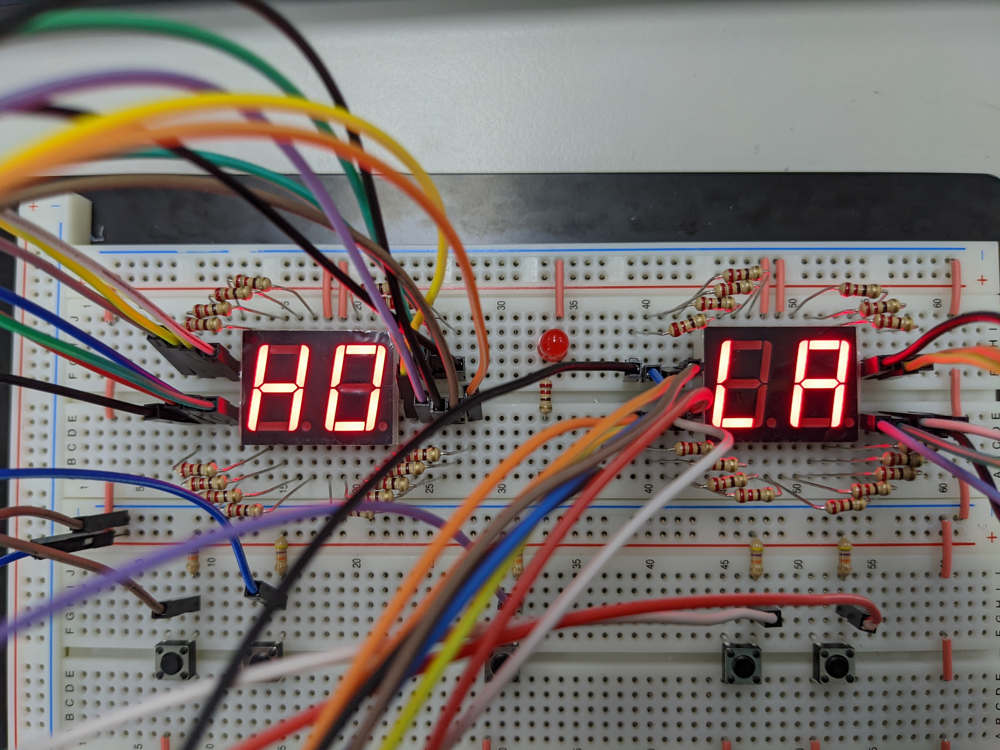
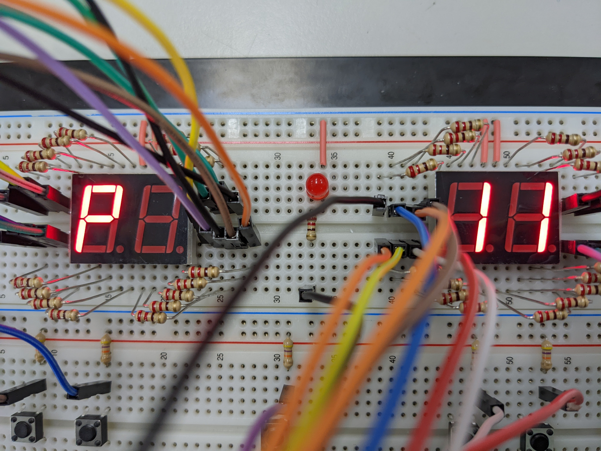
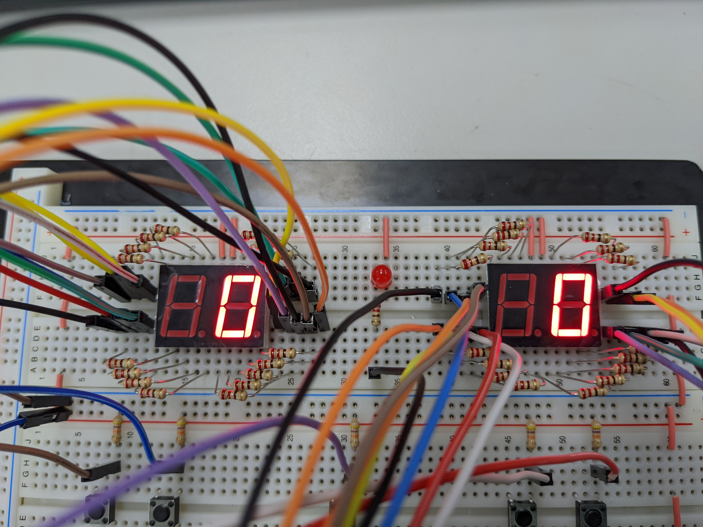
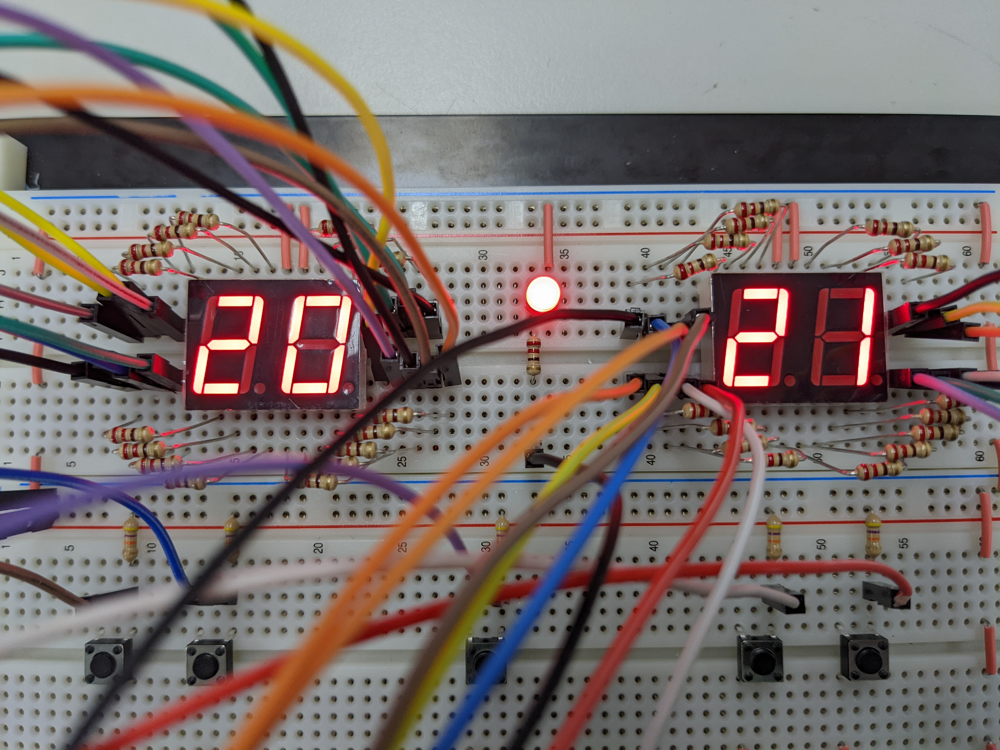
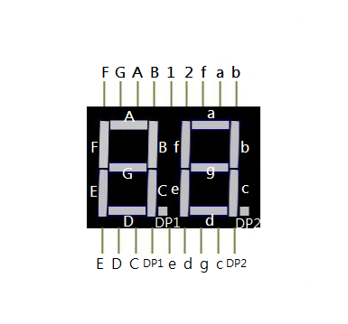
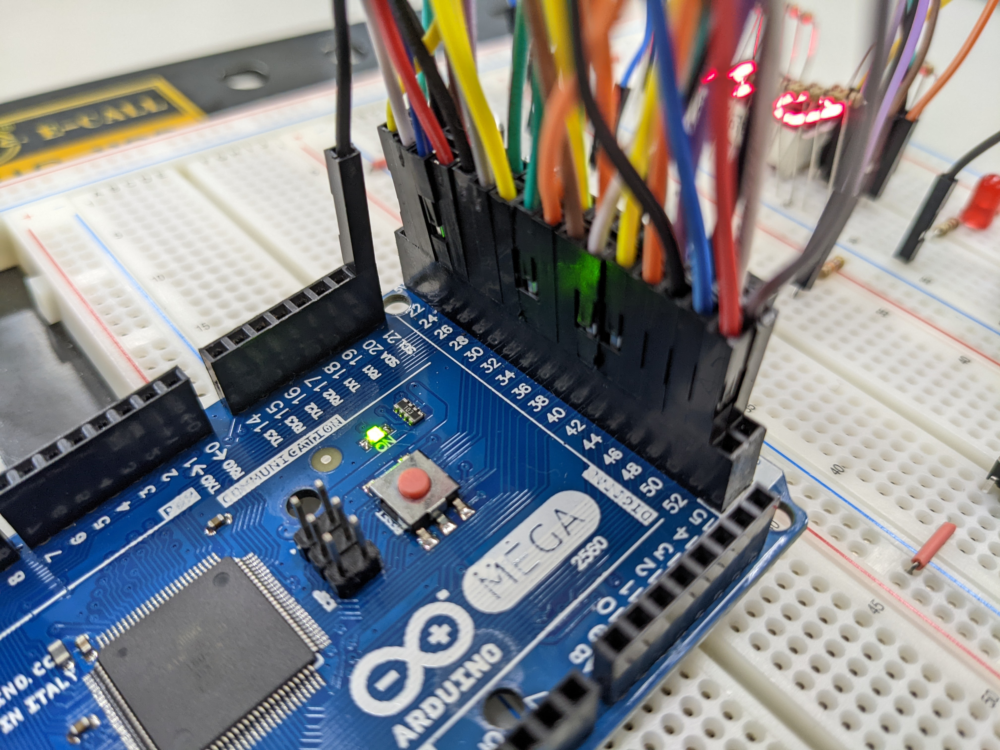
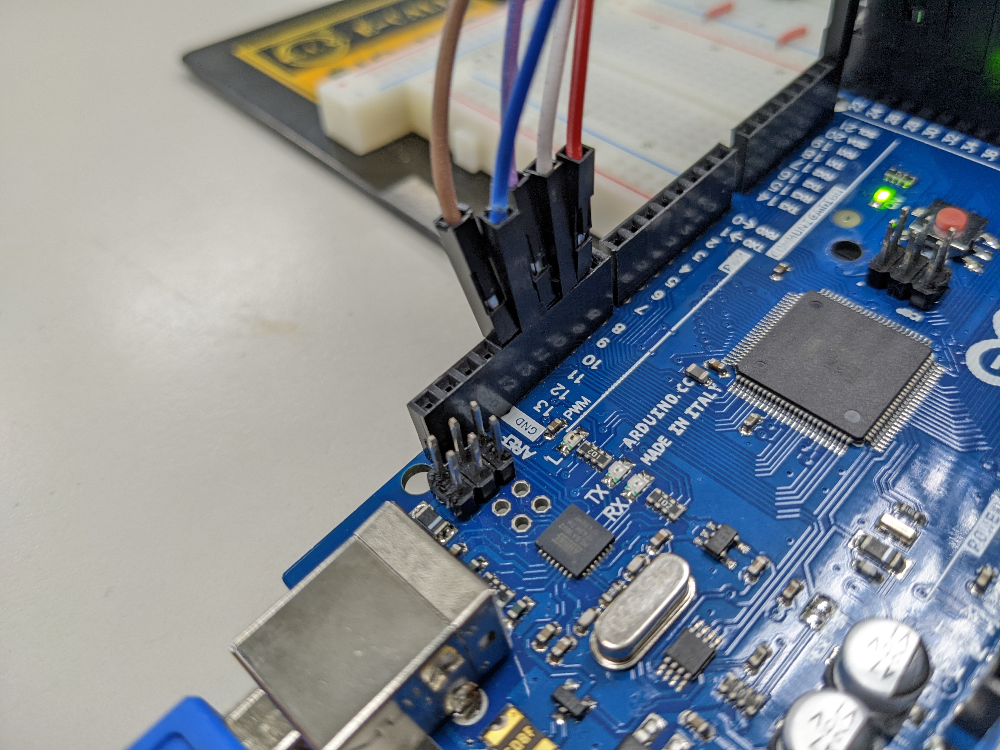
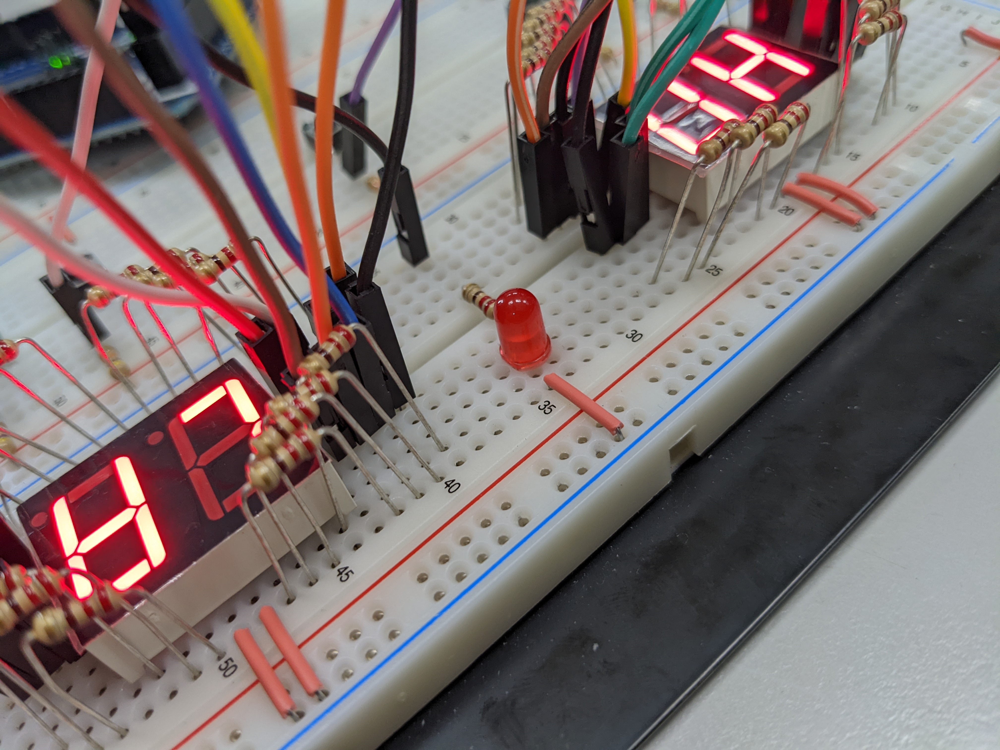
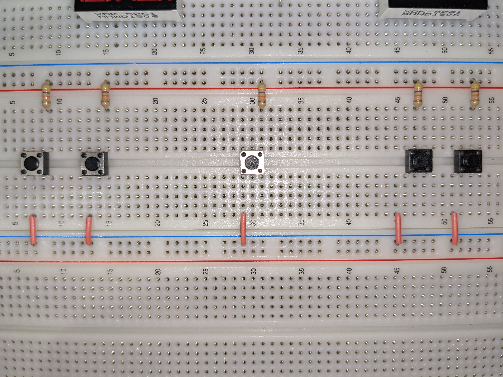

# Arduino-Scoreborad

Customizable victory point, including Deuce function.

> Use Arduino Mega2560 building

## Device Usage Example

| Picture Example | Explain |
| ---- | ---- |
|  | Use [HOLA] to start up represents the machine is ready! |
|  | Using right bonus button and deduction button to set vactory point **P represents Point!** |
|  | Press submit button to start scoring! |
|  | 10 to 10. into Deuce duel !! (Deuce light on) |
|  | 20 to 21...? Exciting!! |
|  | A team wins~ Show winners with flashing dots |

# Make

### Material
| Name | Quantity |
| ---- | ---- |
| Breadboard | 1 |
| Two-digit seven-segment display | 2 |
| Dupont Line | 40 |
| Led | 1 |
| Button | 5 |
| 220Ω resistor | 33 |
| 4.7KΩ resistor | 5 |
| single core wire | 1 |

| Picture Example | Explain |
| ---- | ---- |
|  | Two-digit seven-segment display pinout |

## Configuration

### Foot Position Configuration
```c++
const byte button[]={13,12,11,10,9}; //Button order from left to right
const byte seg_L[]={22,24,26,28,30,32,34,36,23,25,27,29,31,33,35,37}; //Left Side Displayer 22~36 is tens 23~37 is digits [A~DP1]
const byte seg_R[]={38,40,42,44,46,48,50,52,39,41,43,45,47,49,51,53}; //Right Side Displayer 38~52 is tens 39~53 is digits [a~DP2]
#define deuceled  21 //Deuce status Indicator
```

### Hardware wiring

| Picture Example | Explain |
| ---- | ---- |
|  | Segpin |
|  | Buttonpin |
|  | Deuceled |
|  | Button |

**Every Team's below buttons, left side add points, right side minus points. The central button is confirm key**  

  

## Contribute
**Step 1.** You can fork this project to the local, you have the permission to edit/create/upload the files or any contents, you can edit all information.
**Step 2.** When you think your local project can contribute the community, you can considerate send PR(Pull Requests) to the main Repository, we will verify it.